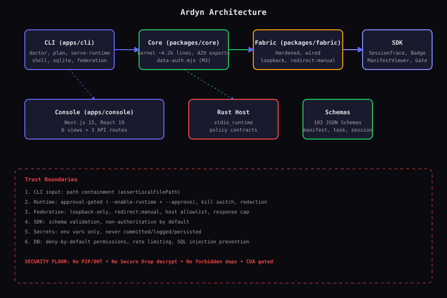
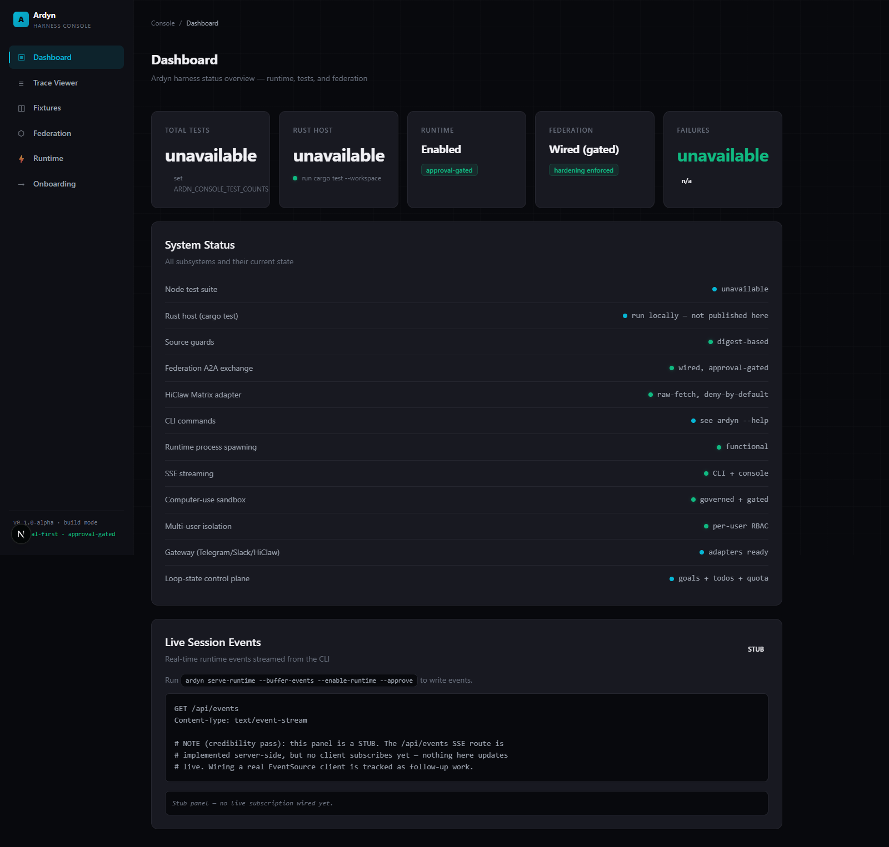
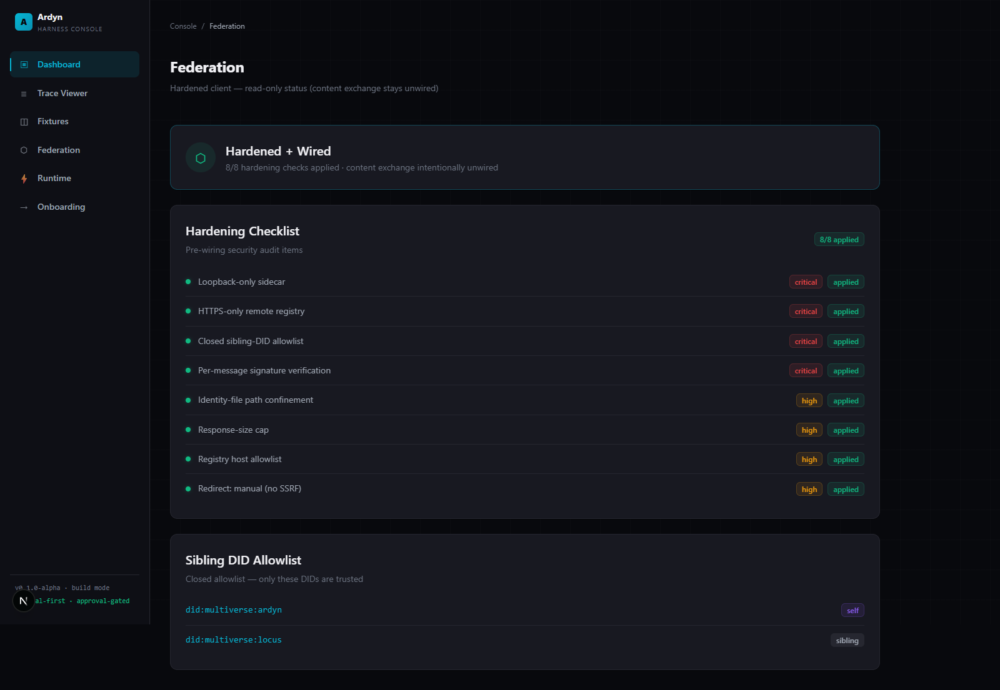
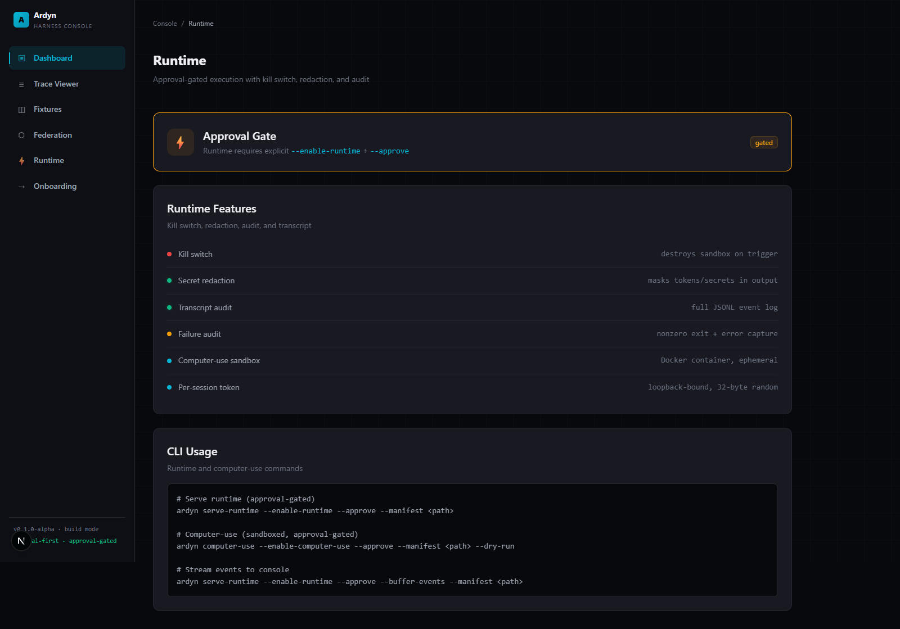
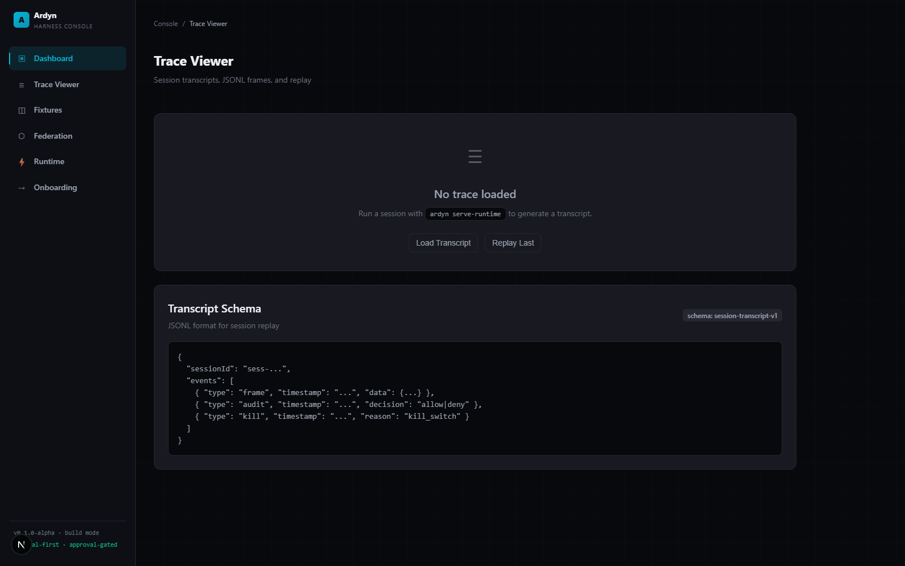
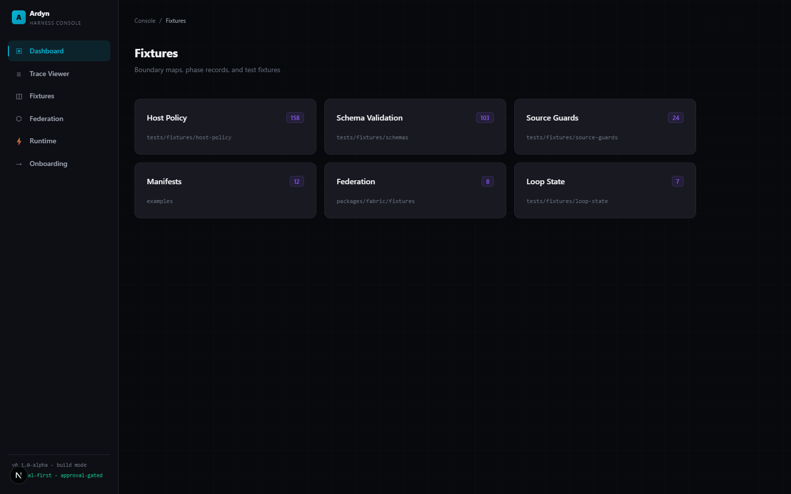
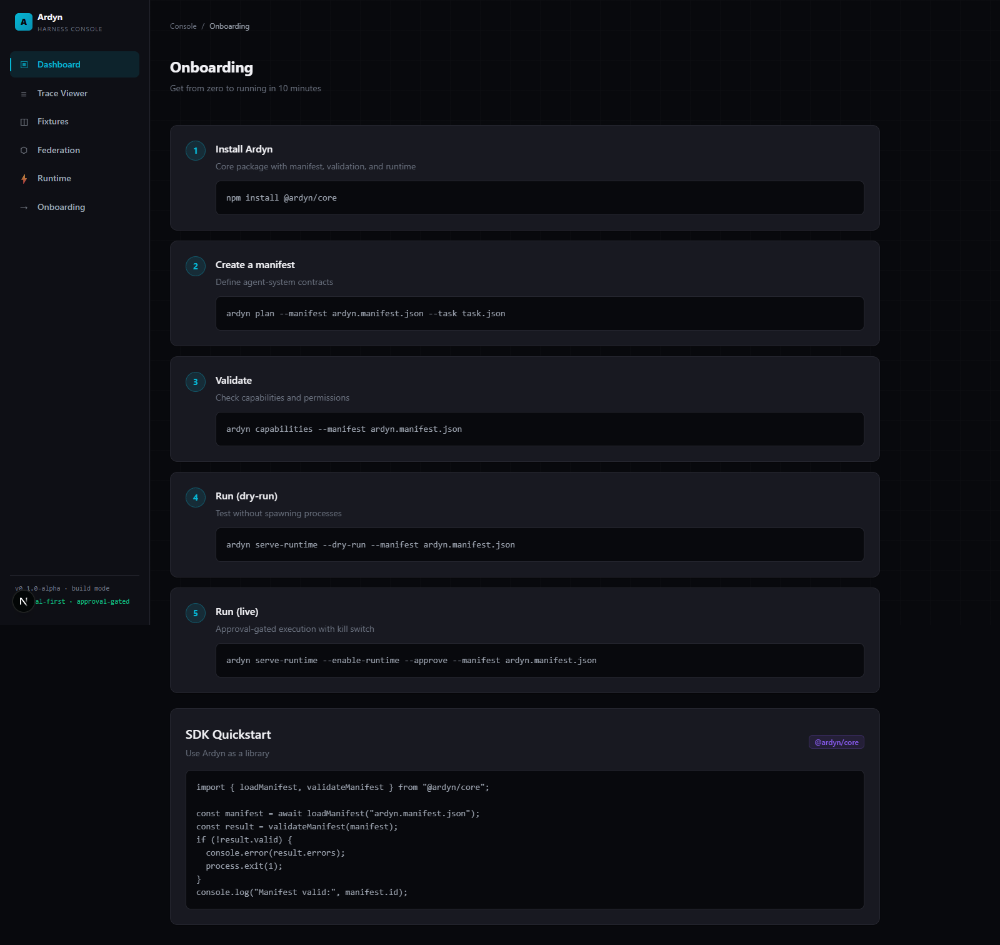

# Ardyn

**Open-source AI harness for defining and running local agent-system contracts with explicit manifests, capabilities, task contracts, and approval-gated runtime.**




*Architecture: CLI → Core → Fabric → SDK, with Rust host, console, schemas, and trust boundaries.*

**Additional diagrams:** [User Flow](docs/diagrams/user-flow.svg) | [Data Flow](docs/diagrams/data-flow.svg) | [Deployment](docs/diagrams/deployment.svg) | [Security Boundaries](docs/diagrams/security-boundaries.svg)

## What it is

Ardyn is an AI harness/framework that lets you define agent-system contracts — manifests, capabilities, tasks — and execute them under approval-gated runtime with kill-switch, redaction, transcript audit, and failure rollback. It includes a CLI (13 commands), a Rust host with real session lifecycle, a fabric federation client (hardened + wired), a consumer SDK with TypeScript types and React display components, an embedded SQLite DB with auth/permissions, multi-user support with per-user isolation, a multi-interface gateway (Telegram + Slack), a loop-state control plane, per-user memory, and a web console with API routes and SSE streaming.

## Why it matters

Agent systems need more than prompts — they need contracts, approval gates, audit trails, and kill switches. Ardyn provides the infrastructure to run agents safely: every action is decided before it happens and recorded after. Computer-use runs in isolated sandboxes, never on the host. Federation A2A handoff exchange is wired and live behind explicit approval flags (`--enable-federation-exchange --approve`) — nothing sends or receives without an operator's say-so.

## Console

The Ardyn Harness Console is a Next.js 15 / React 19 web UI for operating and observing the harness: a "command-room" design with signal-cyan accent, deep void backgrounds, monospace data, and real loading/empty/error states.

> Screenshots below are real captures of the running console (dark "command-room" theme). Run it yourself: `cd apps/console && npm run dev`.








## Quickstart

```bash
# Install
npm ci

# Run tests (local green gate — replaces CI)
node --test tests/*.test.mjs          # 1455+ Node tests (run node --test tests/*.test.mjs)
cargo test --manifest-path crates/ardyn-host/Cargo.toml  # 102 Rust tests (lib + bin targets)

# CLI usage
node apps/cli/src/index.mjs doctor --manifest examples/minimal-manifest/ardyn.manifest.json
node apps/cli/src/index.mjs capabilities --manifest examples/minimal-manifest/ardyn.manifest.json
node apps/cli/src/index.mjs serve-runtime --enable-runtime --approve --manifest examples/minimal-manifest/ardyn.manifest.json
node apps/cli/src/index.mjs computer-use --enable-computer-use --approve --dry-run --manifest examples/minimal-manifest/ardyn.manifest.json
node apps/cli/src/index.mjs federation status

# Console
cd apps/console && npm ci && npx next build && npx next start -p 3000
# Open http://localhost:3000

# Docker
docker build -t ardyn . && docker run -p 3000:3000 ardyn
```

## Architecture

| Component | Path | Description |
|---|---|---|
| CLI | `apps/cli/src/index.mjs` | 14 commands: doctor, identity, capabilities, plan, review-trace, review-artifact, validate-session-transcript, emit-session-events, serve-runtime, computer-use, federation (status/config/send-handoff/receive-handoff), shell, sqlite, serve |
| Core | `packages/core/src/index.mjs` | ⚠️ Partial modularization: ~68.9k-line monolith with 427 exports. First REAL extraction landed (diagnostic-redaction family → `internal/diagnostic-redaction.mjs`); remaining "modules" (validation.js etc.) are still barrel RE-EXPORTS — monolith intact, full split open. Newer code lives in proper modules: processor-pipeline, session-replay (replay+rollback), metrics, glossopetrae-codec, user-memory, provider-adapter |
| Processor pipeline | `packages/core/src/processor-pipeline.mjs` | Pluggable pre/post processors behind the action gateways (policy-gate, audit-record, redact-result built-ins); fail-closed on broken processors |
| Provider adapter | `packages/core/src/provider-adapter.mjs` | Dependency-free BYO-model seam (OpenAI-compatible + Gemini; generate/stream/embed) over raw fetch |
| Computer-use | `packages/core/src/computer-use.mjs` | Governed sandbox (Docker, ubuntu:22.04, Xvfb). Record-before-act gateway via the processor pipeline, take-the-wheel, per-session token |
| Multi-user | `packages/core/src/multi-user.mjs` | Per-user accounts, sessions, sandboxes. Strict isolation (tested) |
| Loop-state | `packages/core/src/loop-state.mjs` | Goals, todos (atomic claims), gates, quota (atomic spend), append-only run history |
| User memory | `packages/core/src/user-memory.mjs` | Per-user memory + profile, keyword search + RAG semantic recall (embeddings stored per row; user_id-prefiltered top-k cosine), strict isolation |
| Gateway | `packages/gateway/src/gateway.mjs` | Telegram + Slack adapters, webhook verification (constant-time), deny-by-default sender allowlist, windowed rate limiter, per-user mapping |
| HiClaw Matrix | `packages/gateway/src/hiclaw-matrix.mjs` | Raw-fetch Matrix client for the HiClaw homeserver (send m.text txn PUTs + /sync receive); deny-by-default room/sender allowlists; NO Matrix SDK, no E2EE |
| Data/auth | `packages/core/src/data-auth.mjs` | SQLite DB, permissions, DB-backed cross-instance rate limiter, secrets helpers |
| Metrics | `packages/core/src/metrics.mjs` | Zero-dep Prometheus registry (`/metrics` on the console; aggregate labels only) |
| Federation | `packages/fabric/src/federation.mjs` + `handoff.mjs` | Hardened client (real Ed25519 verification, streamed-byte size cap, loopback sidecar). A2A handoff exchange WIRED behind `--enable-federation-exchange --approve`; GLOSSOPETRAE-pattern GL1 codec (`packages/core/src/glossopetrae-codec.mjs`) |
| Rust host | `crates/ardyn-host/` | Session lifecycle, stdio runtime, subprocess bridge binary |
| Console | `apps/console/` | Next.js 15 / React 19 web UI with 6 pages + 8 API routes |
| SDK | `packages/sdk/` | TypeScript types + minimal helpers (early stage — see package README) |
| Display components | `packages/sdk/src/components/` | SessionTrace, StatusBadge, ManifestViewer, ApprovalGate |

## Configuration

| Variable | Description | Default |
|---|---|---|
| `ARDYN_CONSOLE_API_KEY` | Console API key (required in production) | unset (open in dev) |
| `ARDYN_CONSOLE_USER_TOKENS` | Per-user auth tokens (JSON) | unset |
| `ARDYN_FABRIC_SIBLING_KEYS` | Federation sibling DID→public-key map (JSON) | unset |
| `ARDYN_FABRIC_IDENTITY_FILE` | Local federation identity file | unset |
| `COMPUTER_RUNTIME` | Computer-use runtime: `docker` or `runsc` (gVisor) | `docker` |
| `NODE_ENV` | Set to `production` to enforce auth | `development` |

## Status

| Milestone | Status | Description |
|---|---|---|
| M0–M8 | ✅ Complete | Runtime, console, federation hardening, docs |
| M9 | ✅ Complete | Computer-use (sandboxed, governed, real spawn) |
| M10 | ✅ Complete | Multi-user support (per-user isolation, tested) |
| M11 | ✅ Complete | Governed computer-use (real sandbox spawn, gateway, take-the-wheel) |
| M12 | ✅ Complete | Loop-state control plane (goals, gates, todos, quota) |
| M13 | ✅ Complete | Multi-interface gateway (Telegram + Slack adapters) |
| M14 | ✅ Complete | Per-user memory (cross-session recall, isolated) |
| Modularization | ⚠️ Partial | Barrel re-export shims only; the ~69k-line `packages/core/src/index.mjs` monolith is intact (real split still open) |
| SSE CLI→console | ⚠️ Partial | Server route + event buffer round-trip tested; console panel is a STUB (no EventSource client subscribes yet) |
| Vercel deployment | ⚠️ Blocked on Josh | Config ready (`vercel.json`, `.vercelignore`), needs `vercel login` (interactive browser auth) |
| Console UI redesign | ✅ Complete | Command-room design with signal-cyan, real states; real screenshots in `docs/assets/` |

## Security

- Computer-use runs ONLY in isolated Docker containers, never the host
- Every session is approval-gated + kill-switchable + audited + secret-redacted (stdout AND stderr)
- Per-user isolation enforced AND tested (sessions, sandboxes, memory incl. RAG recall)
- Federation A2A exchange is WIRED but strictly gated: nothing sends/receives without `--enable-federation-exchange --approve`; closed sibling-DID allowlist + real Ed25519 verification on every message
- Real Ed25519 signature verification for inbound federation messages
- Transcript REPLAY (`serve-runtime --replay`, dry/echo divergence report) and ROLLBACK-on-failure (reverse compensations; fail-closed on unsafe undo) shipped and tested
- Constant-time HMAC comparison for gateway webhook verification
- No secrets committed; all tokens from env / gitignored `config/secret/`
- HiClaw Matrix adapter: raw fetch only — NO Matrix SDK, no E2EE; encrypted events are skipped, never decrypted

## Phase Documentation

Pre-runtime phases (static contracts, no live runtime):
- [Phase 4.0C — Pre-runtime Transport Policy](docs/phase-4-0c-pre-runtime-transport-policy.md)
- [Phase 4.0D — Rust Host Transport Policy Contracts](docs/phase-4-0d-rust-host-transport-policy-contracts.md)
- [Phase 4.0E — Rust Host Policy Metadata](docs/phase-4-0e-rust-host-policy-metadata.md)
- [Phase 4.0F — Host Policy Review Records](docs/phase-4-0f-host-policy-review-records.md)
- [Phase 4.0G — Host Policy Review Comparison](docs/phase-4-0g-host-policy-review-comparison.md)
- [Phase 4.0H — Reviewer Handoff Index](docs/phase-4-0h-reviewer-handoff-index.md)
- [Phase 4.0I — Final Pre-runtime Readiness](docs/phase-4-0i-final-pre-runtime-readiness.md)
- [Phase 4 Stdio Dry-run Event Emission](docs/phase-4-stdio-dry-run-event-emission.md)

Runtime proposal phases:
- [Phase 4.1 — Runtime Proposal](docs/phase-4-1-runtime-proposal.md)
- [Phase 4.1A — Host Policy Approval Records](docs/phase-4-1a-host-policy-approval-records.md)
- [Phase 4.1B — Transport Harness Contracts](docs/phase-4-1b-transport-harness-contracts.md)
- [Phase 4.1C — Framing and Redaction Contracts](docs/phase-4-1c-framing-redaction-contracts.md)
- [Phase 4.1D — Transcript Replay Contracts](docs/phase-4-1d-transcript-replay-contracts.md)
- [Phase 4.1E — Failure Audit and Kill Semantics](docs/phase-4-1e-failure-audit-kill-semantics.md)
- [Phase 4.1F — Runtime Readiness Checkpoint](docs/phase-4-1f-runtime-readiness-checkpoint.md)
- [Phase 4.1G — External Review Packet](docs/phase-4-1g-external-review-packet.md)
- [Phase 4.1H — External Review Disposition](docs/phase-4-1h-external-review-disposition.md)
- [Phase 4.1I — Rust Host Stdio Harness](docs/phase-4-1i-rust-host-stdio-harness.md)

## Roadmap

- Federation content exchange (requires explicit authorization)
- Real container interaction (docker exec with xdotool/import)
- Additional gateway adapters (Discord, WhatsApp, Signal, Email)
- Adaptive per-user UI evolution
- Website scroll experience

## License

Apache-2.0